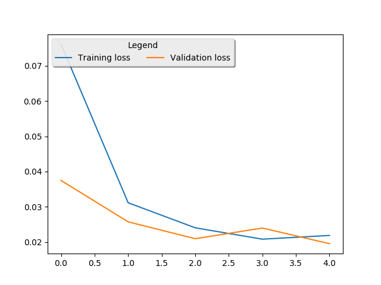

#**Behavioral Cloning** 

### Files Submitted & Code Quality

1. `model.py`: The file that can train the model. Data is assumed to be in `data/driving_log.csv`. All the images are assumed to be inside of `data/IMG` folder.
1. `drive.py`: Mostly the same as the original `drive.py`, but with changed image dim ordering.
1. `video.py`: This file is the same as in the original repository.
1. `plot.py`: Plot the training and validation loss to a file.
1. `loss_plot.png`: The training and validation loss plot.
1. `model.h5`: The trained model.
1. `training_log.csv`: The Keras history for model training.
1. `run1.mp4`: The final video in autonomous mode, driven by the trained network.
1. `writeup.md`: This file.

### Model architecture

All the activations are `elu`. The lambda layer is for normalization. The convolution layers all have valid padding.

This is a replication of the NVidia architecture.

```____________________________________________________________________________________________________
Layer (type)                     Output Shape          Param #                     
====================================================================================================
Cropping2D (70 top, 25 bottom    (None, 65, 320, 3)    0          
____________________________________________________________________________________________________
Normalization (Lambda)           (None, 65, 320, 3)    0                 
____________________________________________________________________________________________________
Conv (5x5 filter, 2x2 strides)   (None, 31, 158, 24)   1824            
____________________________________________________________________________________________________
elu Activation                   (None, 31, 158, 24)   0                 
____________________________________________________________________________________________________
Conv (5x5 filter, 2x2 strides)   (None, 14, 77, 36)    21636             
____________________________________________________________________________________________________
elu Activation                   (None, 14, 77, 36)    0      
____________________________________________________________________________________________________
Conv (5x5 filter, 2x2 strides)   (None, 5, 37, 48)     43248   
____________________________________________________________________________________________________
elu Activation                   (None, 5, 37, 48)     0       
____________________________________________________________________________________________________
Conv (3x3 filter, 1x1 strides)   (None, 3, 35, 64)     27712   
____________________________________________________________________________________________________
elu Activation                   (None, 3, 35, 64)     0       
____________________________________________________________________________________________________
Conv (3x3 filter, 1x1 strides)   (None, 1, 33, 64)     36928           
____________________________________________________________________________________________________
elu Activation                   (None, 1, 33, 64)     0       
____________________________________________________________________________________________________
Flatten                          (None, 2112)          0       
____________________________________________________________________________________________________
Dense                            (None, 1164)          2459532 
____________________________________________________________________________________________________
Dropout                          (None, 1164)          0       
____________________________________________________________________________________________________
Dense                            (None, 100)           116500  
____________________________________________________________________________________________________
Dense                            (None, 50)            5050    
____________________________________________________________________________________________________
Dense                            (None, 10)            510     
____________________________________________________________________________________________________
Dense                            (None, 1)             11      
====================================================================================================
Total params: 2,712,951
Trainable params: 2,712,951
Non-trainable params: 0
____________________________________________________________________________________________________
```

### Training data

The sample training data for track 1 was used. This started as an experiment to see how much data is collection is required, and how much of data collection can be avoided by using data augmentation.

For every row in the sample data:
1. The left, center, and right images were used.
1. A correction factor of 0.2 were used for the left and right images (thus emulating them as if they were center images)
1. The 3 images above were flipped left-to-right to obtain 3 more images. The steering angles in these cases were made negative of what they were.

By using all the cameras, and flipping the images horizontally, we can effectively teach the network on how to come to the center from the sides. Flipping the images gave the same impression as travelling the track backwards, thus generalizing the data further.

### Attempts to reduce overfitting in the model

The model contains dropout layers in order to reduce overfitting (model.py lines 128). 

### Model parameter tuning

The model used an adam optimizer, so the learning rate was not tuned manually (model.py line 134).

### Approach to the solution

Firstly, I designed a simple network to check the entire workflow end to end. Whether `drive.py` worked as expected on a trained model or now. 5 epochs were used for all iterations, including the final model.

Next, I started with the NVidia architecture, and it looked complex enought for the case. This architecture was initially trained on the sample dataset for track 1 by only using center images. However, the vehicle was baised towards taking left turns and would eventually fall off the track.

Next, I augmented the existing data and also made use of the side cameras. My analysis is that the side cameras are good at teaching the network on recovering towards the center. The correction factor of 0.2 (the same as in the lectures) were used.

Also, the 3 images were flipped horizontally to "simulate" driving around the track in the opposite direction, thus generalizing the training data further.

Training on a GTX 1070 didn't take much time. The car drove itself well within the lane, so no further optimisations were performed.

### Training and validation loss

The following graph represents the training and validation loss over 5 epochs.



The training and validation loss reduce with each epoch, and are approximately the same towards the end of 5 epochs. Thus, the model is not overfitting.

### Final video

The final video is saved as `run1.mp4`.
